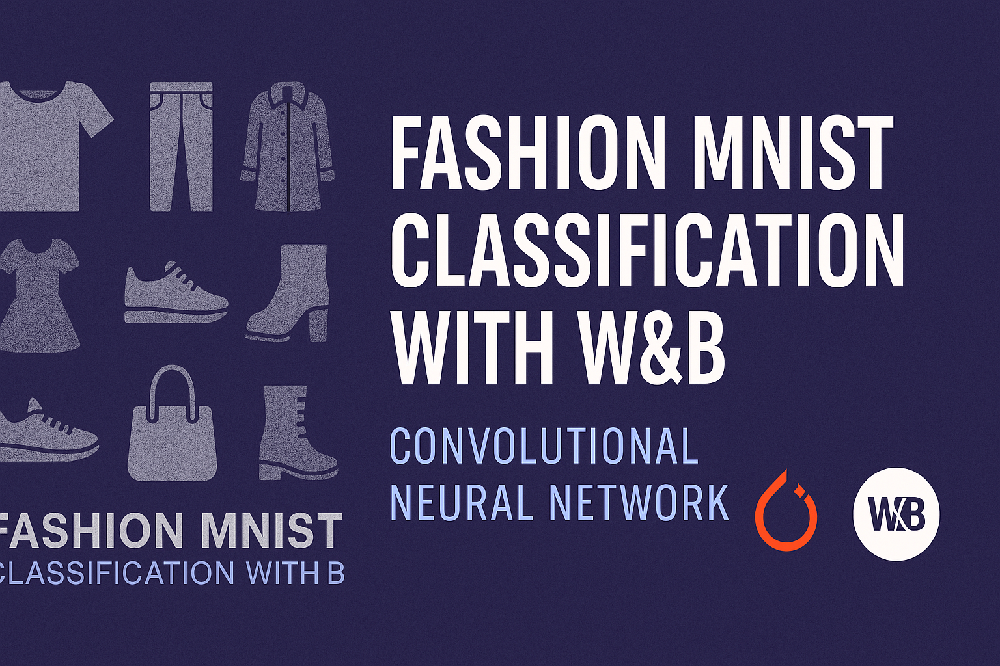

#  Fashion MNIST Classification with W&B (PyTorch)

---

<p align="center">
  
</p>

---

This project builds a Convolutional Neural Network (CNN) to classify images from the [Fashion MNIST dataset](https://github.com/zalandoresearch/fashion-mnist). The entire training pipeline is integrated with [Weights & Biases (W&B)](https://wandb.ai/) to enable seamless experiment tracking, visualization, and hyperparameter optimization.

>  Built using PyTorch and tested entirely on Google Colab.  
>  Hyperparameter tuning via W&B Sweeps.  
>  Fully aligned with academic assignment requirements.

---

##  Features

-  **Live logging** of training and validation loss/accuracy to W&B
-  **Hyperparameter sweeps** with random search strategy
-  Visualize training performance over multiple runs
-  Experiment with dropout rates, learning rates, batch sizes, and epochs
-  Uses Fashion MNIST dataset (10 grayscale classes)

---

##  Model Architecture

```
Input Layer       : 28x28 grayscale image
Conv2D (32, 3x3)  : ReLU
MaxPooling (2x2)
Conv2D (64, 3x3)  : ReLU
MaxPooling (2x2)
Flatten
Dense (128)       : ReLU
Dropout (0.3 / 0.5 / 0.7)
Output (10)       : Softmax
```

---

##  Base Configuration

```python
learning_rate: 0.001  
batch_size   : 64  
epochs       : 10  
dropout_rate : 0.5  
```

---

##  Hyperparameter Sweep

Performed a **random search sweep** to optimize:

| Hyperparameter   | Values                             |
|------------------|-------------------------------------|
| `learning_rate`  | [0.01, 0.001, 0.0001]               |
| `batch_size`     | [32, 64, 128]                       |
| `epochs`         | [5, 10, 15]                         |
| `dropout_rate`   | [0.3, 0.5, 0.7]                     |

-  **Metric optimized:** Validation Accuracy  
-  **Sweep count:** 10 runs

---

##  Project Structure

```
fashion-mnist-wandb-cnn/
│
├── WandB.ipynb     # Colab notebook (PyTorch)
├── README.md                     # Project overview (this file)
├── requirements.txt              # List of required packages
└── sweep_config.json (optional)  # W&B Sweep configuration
```

---

##  Example Logs & Results

Track experiments at: [https://wandb.ai/m24csa013-indian-institute-of-technology-jodhpur/fashion-mnist-classification?nw=nwuserm24csa013](https://wandb.ai/)  

---

##  Installation

If running locally:

```bash
git clone https://github.com/rishi02102017/fashion-mnist-wandb-cnn.git
cd fashion-mnist-wandb-cnn
pip install -r requirements.txt
```

Or run directly in **Google Colab** [📎 Notebook Link](https://colab.research.google.com/drive/1D4LbbEM8hlCeJAcHNpZ4ClQzGy0Kn5Nu)

---

##  Skills Demonstrated

- PyTorch CNN implementation  
- Real-time experiment tracking with W&B  
- Hyperparameter tuning using random sweeps  
- Evaluation and comparison of model performance

---

##  Author

**Jyotishman Das**  
Master's AI Student @ IIT Jodhpur  
GitHub: [rishi02102017](https://github.com/rishi02102017)  
Website: [Portfolio](https://my-portfolio-jyotishman-das-projects.vercel.app/)

---

##  License

This project is for educational and demonstration purposes.
